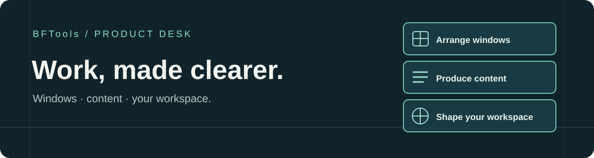

# Lydiahub

 

> **我把工作里那些容易丢掉的想法、重复做的事情，做成可以真正用起来的小工具。**
>
> *不是为了堆更多功能，而是让下一步变得更容易。*

I turn recurring work into practical tools. Some are free to share; others are built with a team and offered as paid products.

[开始使用](GETTING-STARTED.md) · [我在做什么](#我在做什么) · [为什么做](#为什么做) · [获取与交流](#获取与交流)

---

## 从这里开始

如果你是从视频过来的，不用先研究一堆介绍：

1. 按你的问题挑一个产品；
2. 打开[上手页](GETTING-STARTED.md)，先看适用场景和安装方式；
3. 到对应产品页查看当前可用版本和获取方式；基础工具也可从[爱发电入口](https://afdian.com/a/lydiahub2026)领取。

有些基础工具免费分享，也有试用后付费的产品；每个工具的获取方式以自己的产品页为准。遇到问题可以提 Issue，也可以在抖音主页群聊里交流；需要定制、部署适配或长期维护，再单独联系。

<table>
<tr>
<td width="25%"><b>想法总是记不住</b> → Obsidian 工作流</td>
<td width="25%"><b>Codex 看腻了原生界面</b> → 皮肤与管理工具</td>
<td width="25%"><b>重复运营工作太多</b> → WorkBuddy 数字员工</td>
<td width="25%"><b>有些问题想继续想</b> → 回声 APP</td>
</tr>
</table>

**正在做 Windows 多窗口工作？** [BFTiles](https://github.com/mercedesbestsupplier-maker/BFTiles) 把窗口排布、筛选和常用布局放在一起，适合同时处理多个应用或账号。它是我与 BFTools 团队共创的商业软件；公开页面会注明试用和订阅方式。

---

## 我在做什么

### BFTiles · 让一屏多开更清楚

窗口开得多时，麻烦常常不是“排不整齐”，而是下次打开又要从头找、从头摆。我和 BFTools 团队正在让排布更快、窗口更好辨认，并把 Windows 安装包的获取、更新与问题反馈放到独立的 [BFTiles 产品页](https://github.com/mercedesbestsupplier-maker/BFTiles)。这是试用后付费的产品，应用源码保持私有。

### Obsidian 工作流 · 让记录继续走下去

灵感往往不是没有出现过，而是出现的时候，手边没有一个足够顺手的入口。

这个工具把待办和灵感先接住，保存成 Markdown，再和 Obsidian、Codex 联动整理。记录不再停在“我想过”，而是能继续走到“我准备做什么”。

### Codex 皮肤与管理工具 · 让工作界面更像自己的

我做了 100 多款 Codex 皮肤，也做了一个可以搜索、预览、一键安装、切换和恢复的管理工具。你可以直接使用，也可以按自己的习惯制作新的皮肤。

皮肤不是为了炫技。每天要面对几个小时的工作界面，颜色、节奏和熟悉感，确实会影响一个人愿不愿意继续做下去。

### WorkBuddy 数字员工工作台 · 把重复工作交给流程

很多工作并不难，只是每天都要从头来一遍：找资料、列选题、改格式、做检查、再把结果交接出去。

数字员工工作台把这些重复步骤拆成可执行的工作流，让人把时间留给判断、创意和真正需要负责的决定。

### 回声 APP · 给重要的问题留一段可以回来的对话

有些问题当下没有答案，但值得被认真留下来。

回声围绕人生阶段、选择和关系做记录与对话。它不替你下结论，只帮你把模糊的感受说清楚；等你走到下一段路，还能回来看看当时的自己。

---

## 为什么做

我不太想再做一个“功能很多，但打开以后不知道先点哪里”的产品。

我更在意三件小事：

- 突然想到的东西，能不能在十秒内留下来；
- 重复做过很多次的工作，能不能交给一套可靠的流程；
- 一个人在长期使用工具时，能不能感觉到它真的在帮自己。

这些产品都来自真实使用中的卡点。先做出能用的版本，再让使用的人告诉我哪里还不顺。

## 获取与交流

- [基础工具领取与更新入口（爱发电）](https://afdian.com/a/lydiahub2026)
- [BFTiles 的 Windows 版本与反馈](https://github.com/mercedesbestsupplier-maker/BFTiles)
- 使用问题、建议和 Bug，欢迎在对应仓库提交 Issue
- 微信：`lydiahub2026`

部分个人工具和基础版本会免费分享；BFTiles 等商业产品会在各自页面说明试用和订阅条件。企业或团队如果需要定制功能、部署适配、数据迁移或长期维护，再单独沟通。

## 我相信

**好工具不是替你生活，而是帮你少丢掉一点想法，少重复一点消耗，多留一点力气给真正重要的事。**

我会继续把遇到的问题做成小而完整的产品，把能公开分享的部分免费放出来。
